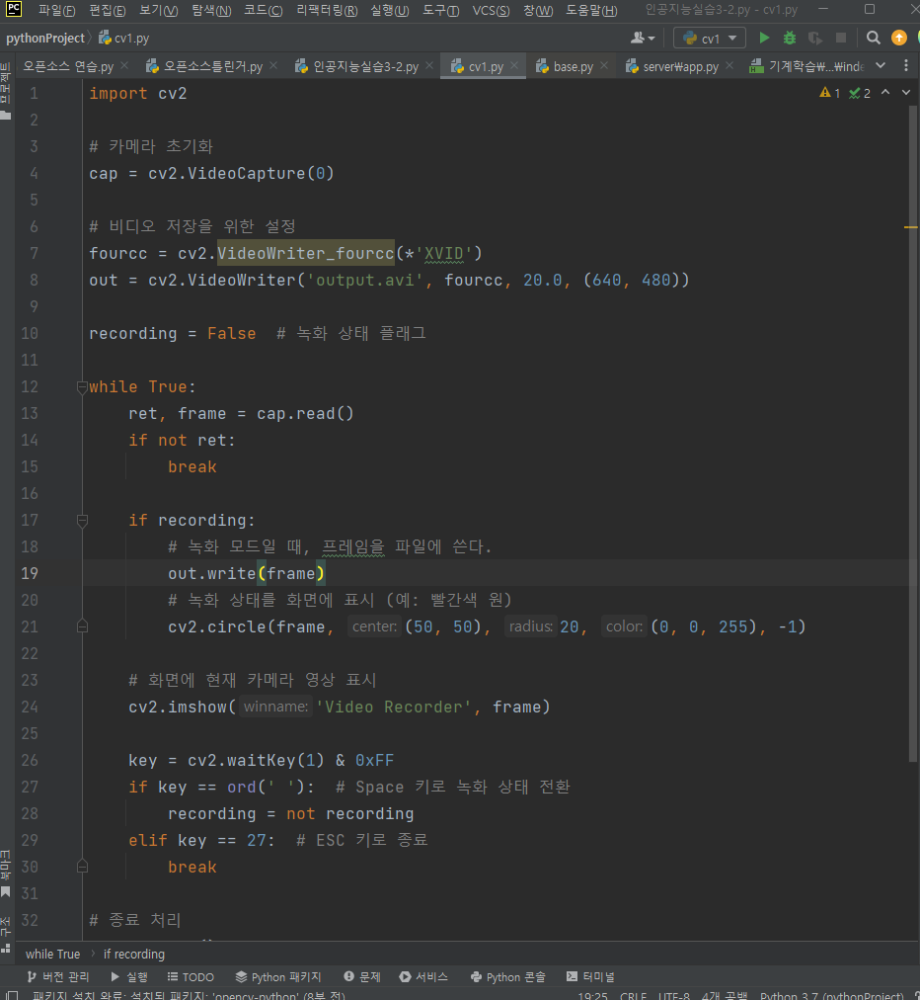
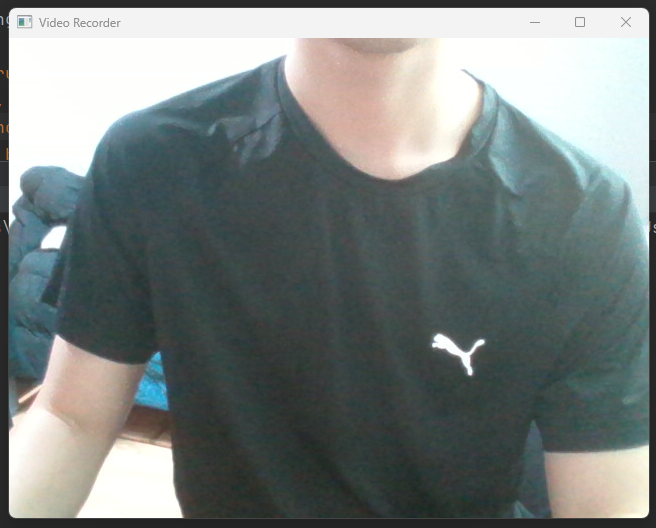
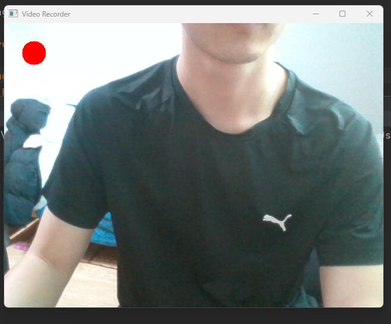

# My simple webcamera recoder

 
 
 
 

## 배경

 수업시간에 배운 openCV를 활용해서 간단한 webcamera recoder를 만들어보았습니다.
 
 
 

## 설명

여기서 코드를 실행합니다.

여기서 스페이스바를 눌러 실행할 수 있고
ESC키를 눌러 종료할 수 있습니다.

스페이스바를 눌러 녹화를 시작할 수 있고 
스페이스바를 눌러 녹화를 종료할 수 있습니다.

## 결과
해당 폴더안에 output이라는 동영상으로 저장됩니다.

 

## 참고

* GPT4

* CV수업자료

   

