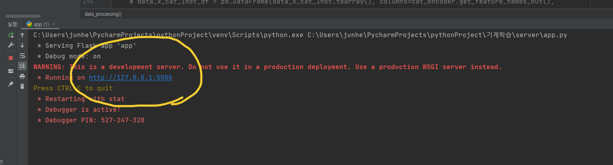
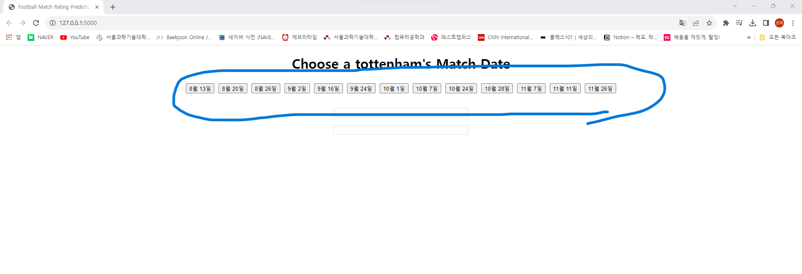
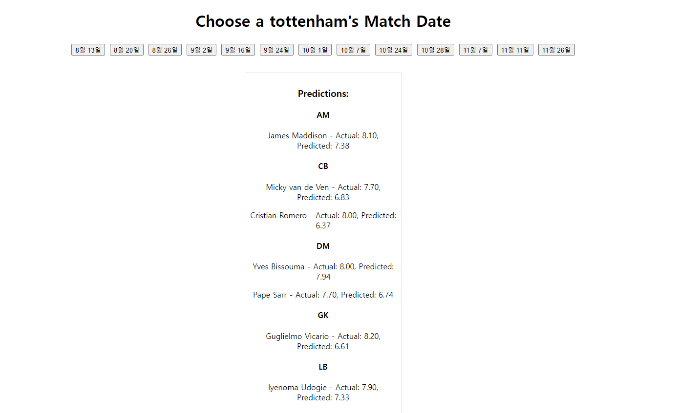
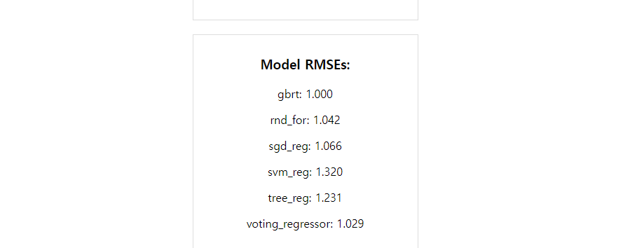

# 토트넘23-24시즌 경기별 평점 예측 웹페이지

 
 
 
 

 
 
 

## 배경

 이번시즌 토트넘에서 손흥민과 오래 뛰었던 케인이 팀을 나가 걱정이 많았으나 좋은 성적을 유지하며 손흥민도 득점순위에 올라와 있는 것을 발견하였습니다. 그래서 이번에 배운 머신러닝 모델을 활용하여 선수들의 평점을 예측해주는 서비스를 만들어보고 싶어 **토트넘23-24시즌 경기별 평점 예측** 을 만들게 되었습니다.

기계학습 수업시간에 배운 모델들을 학습시켜 예측해보고 끝나는 것이 아니라 축구에 관심이 많은 다른 사람들이 함께 즐겼으면 하는 마음에 서버를 통해 웹페이지로 언제든지 접근할 수 있게 만들어보았습니다.

 
 
 

## 설명
이 프로젝트는 3가지 부분으로 나뉘어 있습니다.

* 데이터와 전처리( modeltoserver폴더안 아카이브 2폴더안)
풋몹이라는 사이트에서 api를 제공하여 유럽 축구 관련 데이터를 제공합니다.

main.py라는 파일을 통해 경기별 데이터를 가져왔습니다.

그다음 model 폴더안 기계학습프로젝트3.ipynb을 통해 전처리를 완료하였고

기계학습프로젝트_전처리끝.ipynb 로 모델에서 활용할 수 잇게 정리하였습니다.

 

* 머신러닝 모델 (model 폴더에 들어있습니다.)

선형회귀 | 결정트리 | svm | 랜덤포레스트 | 그래디언트 부스트 | 앙상블

1. 선형회귀 (정규방정식, sgd을 이용한 선형회귀, 다항회귀)
2. 결정트리 (랜덤서치를 통한 최적 파라미터 선택)
3. svm(선형 svm, 다항 2차 커널적용, rbf커널적용)
4. 랜덤포레스트 (랜덤서치를 통한 최적 파라미터 선택)
5. 그래디언트부스트(스크레치, 사이킷런 클래스 비교)
6. 5가지 모델 종류에서 가장 성능이 좋은 모델을 선택하여 앙상블 모델

 

* 백앤드

머신러닝 모델을 피클로 불러와 웹페이지에 보여줄 수 있게
flask를 통해 백엔드를 구현하였습니다.
(modeltoserver폴더안 app.py)
학습된 모델을 활용하기 위해 피클을 활용하였습니다. 
chatgpt와  '머신 러닝 교과서 with 파이썬, 사이킷런, 텐서플로'를 참고하여 구현했습니다.

* 프론트엔드
html, css, JavaScript 를 통해 구현하였습니다.
(server폴더안 templates로 구현하였습니다.)

 
 
 

## 사용법

1. git clone https://github.com/junheehong98/junheehong98/tree/main/oss
을 통해 다운로드 합니다.

1.  server 폴더안에 들어 있는 app.py를 실행합니다.

1. 127.0.0.1 로컬 호스트 ip주소를 클릭하면 웹 페이지가 열립니다.

1. 이번시즌 토트넘 경기한 날짜가 라운드별로 적혀있어 해당 날짜 버튼을 누르기

1. 날짜에 해당하는 선수들의 데이터를 가지고
선형회귀, 결정트리, svm, 랜덤포레스트, 그래디언트 부스트, 기존에 썻던 것을 모두 앙상블한 모델이 그 선수들의 평점을 예측 합니다.

1. 그다음 rmse를 통해 성능을 평가한뒤 가장 성능이 좋은 모델을 선택하여
선수들의 실제 평점과 예측한 평점을 화면에 보여줍니다.

 
 
 

## 모델 성능 비교(RSME)
 
* 훈련데이터
 

선형회귀 | 결정트리 | svm | 랜덤포레스트 | 그래디언트 부스트 | 앙상블
--------| --------| -------| -------| -------| -------
정규방정식: 0.5259  | 0.6630 | 리니어 0.5375 |  0.5886 | 직접 0.5859 |  0.4823
SGD L1 규제: 0.5256 | -------| 2차 커널 1.0070 | -------| 클래스  0.4852 |  -------
SGD L2 규제: 0.5310 | -------| rbf 커널 0.5914 | -------| -------| -------

 
 

* 테스트데이터

 
선형회귀 | 결정트리 | svm | 랜덤포레스트 | 그래디언트 부스트 | 앙상블
--------| --------| -------| -------| -------| -------
정규방정식: 0.4984 | 0.6495 | 리니어 0.5438 | 0.5796 | 직접 0.5856 |  0.5409
SGD L1 규제: 0.5008 |   -------| 2차 커널 1.016 | -------| 클래스  0.5285 | -------
SGD L2 규제: 0.0.5107 | -------| rbf 커널 0.6951 | -------| -------| -------

 
 
 

## 데이터 셋
[풋몹](https://www.fotmob.com/ko/leagues/47/stats/premier-league/players)

 
 
 

## 사용 api(데이터 불러오기)

[JavaScript버전](https://github.com/bgrnwd/fotmob)
 

[파이썬버전](https://github.com/bgrnwd/mobfot)

   

## 참고

* Aurelien Geron, Hands-on Machine Learning with Scikit-Learn, Keras & 
TensorFlow, 3rd Edition, O'REILLY

* 머신 러닝 교과서 with 파이썬, 사이킷런, 텐서플로

* https://youtu.be/0irmDBWLrco?feature=shared

* https://www.kaggle.com/datasets/irkaal/english-premier-league-results

* https://www.kaggle.com/datasets/quadeer15sh/premier-league-standings-11-seasons-20102021

* chatgpt

   

## 주석
이 프로젝트에서 사용된 모델은 기계학습 수업 프로젝트에서 만들었습니다. (전처리와 모델 구현은 제 담당이었습니다.)

  
## 라이센스

[LICENSE](https://github.com/junheehong98/junheehong98/tree/main/oss/LICENSE)

