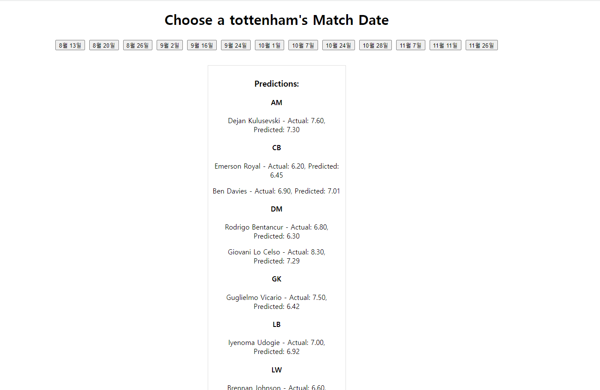

# 토트넘23-24시즌 경기별 평점 예측

## 배경

 이번시즌 토트넘과 손흥민의 성적이 우수하여 관심이 많이 갔습니다. 그래서 이번에 배운 머신러닝 모델을 활용하여 선수들의 평점을 예측해주는 서비스를 만들어보고 싶어 **토트넘23-24시즌 경기별 평점 예측** 을 만들게 되었습니다.

또한 기계학습 수업시간에 나온 단순히 모델을 구현하여 예측해보고 끝나는 것이 아니라 다른사람도 함께 즐기면 좋겠다는 생각에 서비스로 만들어 보아 
실생활에서 머신러닝 모델을 통해 편해졌으면 좋겠다는 동기로 서비스로 만들어 보았습니다.

## 설명
이 프로젝트는 3가지 부분으로 나뉘어 있습니다.

선형회귀 | 결정트리 | svm | 랜덤포레스트 | 그래디언트 부스트 | 앙상블

* 머신러닝 모델 

1. 선형회귀 (정규방정식, sgd을 이용한 선형회귀, 다항회귀)
2. 결정트리 (랜덤서치를 통한 최적 파라미터 선택)
3. svm(선형 svm, 다항 2차 커널적용, rbf커널적용)
4. 랜덤포레스트 (랜덤서치를 통한 최적 파라미터 선택)
5. 그래디언트부스트(스크레치, 사이킷런 클래스 비교)
6. 5가지 모델 종류에서 가장 성능이 좋은 모델을 선택하여 앙상블 모델

* 백앤드

머신러닝 모델을 피클로 불러와 웹페이지에 보여줄 수 있게
flask를 통해 백엔드를 구현하였습니다.

* 프론트엔드
html, css, JavaScript 를 통해 구현하였습니다.

## 사용법

1. git clone https://github.com/junheehong98/junheehong98/tree/main/oss
을 통해 다운로드 합니다.

1.  server 폴더안에 들어 있는 app.py를 실행합니다.

1. 127.0.0.1 로컬 호스트 ip주소를 클릭하면 웹 페이지가 열립니다.

1. 이번시즌 토트넘 경기한 날짜가 라운드별로 적혀있어 해당 날짜 버튼을 누르기

1. 날짜에 해당하는 선수들의 데이터를 가지고
선형회귀, 결정트리, svm, 랜덤포레스트, 그래디언트 부스트, 기존에 썻던 것을 모두 앙상블한 모델이 그 선수들의 평점을 예측 합니다.

1. 그다음 rmse를 통해 성능을 평가한뒤 가장 성능이 좋은 모델을 선택하여
선수들의 실제 평점과 예측한 평점을 화면에 보여줍니다.

## 모델 성능 비교

*훈련데이터
선형회귀 | 결정트리 | svm | 랜덤포레스트 | 그래디언트 부스트 | 앙상블
--------| --------| -------| -------| -------| -------

*테스트데이터
선형회귀 | 결정트리 | svm | 랜덤포레스트 | 그래디언트 부스트 | 앙상블
--------| --------| -------| -------| -------| -------

## 데이터 셋
[풋몹] (https://www.fotmob.com/ko/leagues/47/stats/premier-league/players)

## 사용 api(데이터 불러오기)

[JavaScript버전](https://github.com/bgrnwd/fotmob)

[파이썬버전](https://github.com/bgrnwd/mobfot)

## 참고

* Aurelien Geron, Hands-on Machine Learning with Scikit-Learn, Keras & 
TensorFlow, 3rd Edition, O'REILLY

* 머신 러닝 교과서 with 파이썬, 사이킷런, 텐서플로

* https://youtu.be/0irmDBWLrco?feature=shared

* https://www.kaggle.com/datasets/irkaal/english-premier-league-results

* https://www.kaggle.com/datasets/quadeer15sh/premier-league-standings-11-seasons-20102021

* chatgpt

## 주석
이 프로젝트에서 사용된 모델은 기계학습 수업 프로젝트에서 만들었습니다.

## 라이센스

